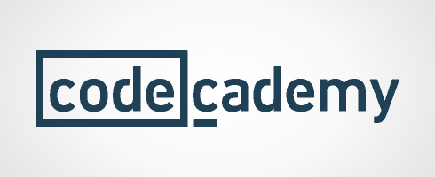

# CodeCademy Python

This contains the projects from CodeCademy python program, used to practice and improve on getting experience with Python programming language.

Python is a general-purpose, versatile and popular programming language. It is concise and easy to read, and it is also a good language to have in any programmer’s stack as it can be used for everything from web development to software development and data science applications.

Python is an interpreted, high-level, open-source, programming language that supports procedural, object-oriented, and some functional programming constructs.

pip is the default package manager for Python. It is distributed with Python, which means that when you install Python, pip is automatically installed on your computer! You will use pip from the command line to add packages from the Python Package Index (PyPI) https://pypi.org/, a repository of software for the Python programming language, to your Python applications.

Link to cheatsheet: https://www.codecademy.com/learn/learn-python-3/modules/learn-python3-hello-world/cheatsheet

